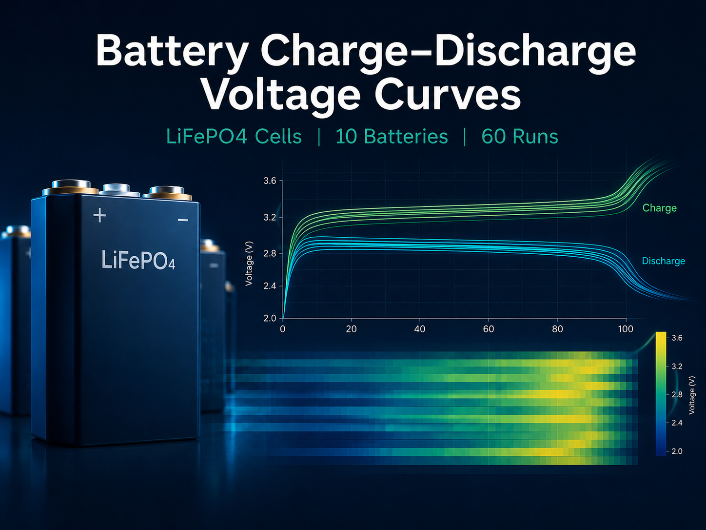

# Battery Characterization Datasets

Open experimental datasets for rechargeable-battery research, released under
**CC BY 4.0**. This repository mirrors two datasets also published on
**IEEE DataPort**, in a Git-friendly form (CSV + XLSX, browsable directly on
GitHub). All measurements were performed at the National University of Science
and Technology POLITEHNICA Bucharest.

| Dataset | Cells | Measurement | IEEE DataPort |
|---|---|---|---|
| [24-hour OCV relaxation](ocv-relaxation-24h/) | 8 cells · 6 chemistries | 24 h open-circuit-voltage relaxation after charge/discharge | [record](https://ieee-dataport.org/documents/24-hour-raw-ocv-relaxation-dataset-rechargeable-batteries-different-chemistries) |
| [Charge–discharge voltage curves](charge-discharge-voltage-curves/) | 10 LiFePO4 cells | CCCV charge + 3 constant-current discharge profiles | [record](https://ieee-dataport.org/documents/battery-charge-discharge-voltage-curves) |

---

## 1. 24-hour OCV Relaxation Dataset


Raw 24-hour open-circuit-voltage (OCV) relaxation for **8 rechargeable cells**
across six chemistries (LiFePO4, NMC, LiCoO2, LiPo, NiCd, NiMH), recorded after
charge- and discharge-based SOC conditioning. 1-minute sampling, 30 relaxation
traces. Useful for SOC estimation, OCV/hysteresis analysis, and equivalent-circuit
or data-driven model validation.

- 📂 **Folder:** [`ocv-relaxation-24h/`](ocv-relaxation-24h/) — XLSX workbook, 16 CSV traces, full README
- 🔗 **IEEE DataPort:** https://ieee-dataport.org/documents/24-hour-raw-ocv-relaxation-dataset-rechargeable-batteries-different-chemistries
- 📄 **Related paper:** Voicila et al., *Enhanced OCV Estimation in LiFePO4 Batteries: A Novel Statistical Approach Leveraging Real-time Knee/Elbow Detection*, MDPI Batteries **11(5)**, 2025 — https://www.mdpi.com/2313-0105/11/5/186

## 2. Charge–Discharge Voltage Curves Dataset



Raw charge and discharge voltage curves for **10 LiFePO4 cells** (5 Lithium Werks
APR + 5 BSE), under CCCV charging and three constant-current discharge profiles —
**60 curves** total, 1-second sampling. Useful for capacity estimation, cell-to-cell
consistency analysis, and model validation.

- 📂 **Folder:** [`charge-discharge-voltage-curves/`](charge-discharge-voltage-curves/) — XLSX workbook, 20 CSV curves, full README
- 🔗 **IEEE DataPort:** https://ieee-dataport.org/documents/battery-charge-discharge-voltage-curves
- 📄 **Related paper:** Voicila et al., *A high-speed multi-chemistry and multi-battery state-of-health screening system for retired lithium-ion batteries*, UPB Sci. Bull. Series C, **87(3)**, 2025

---

## Repository structure

```
battery-datasets/
├── ocv-relaxation-24h/
│   ├── README.md                 # full metadata for this dataset
│   ├── ocv_relaxation_24h.xlsx   # workbook (Header sheet + 16 data sheets)
│   ├── OCVR.png
│   └── csv/                      # 16 CSV traces (one per data sheet)
└── charge-discharge-voltage-curves/
    ├── README.md                 # full metadata for this dataset
    ├── charge_discharge_voltage_curves.xlsx
    ├── BCDC.png
    └── csv/                      # 20 CSV curves (10 charge + 10 discharge)
```

## How to use

- Each dataset folder has its **own README** with the complete metadata: battery
  specifications, equipment, test conditions, conditioning procedures, and column
  formats.
- The **CSV** files in each `csv/` folder are ready to load directly in Python,
  MATLAB, R, etc. The **XLSX** workbook additionally contains a `Header` metadata
  sheet.
- Time is reported in **hours `[h]`** and voltage in **volts `[V]`**.

Quick load example (Python):

```python
import pandas as pd
df = pd.read_csv("ocv-relaxation-24h/csv/ocv_relaxation_24h__24h_discharge_apr.csv")
print(df.head())
```

## License

Released under the **Creative Commons Attribution 4.0 International (CC BY 4.0)**
license — see [LICENSE](LICENSE). You are free to share and adapt the data
(including commercially) **with appropriate attribution**. When using the data,
please cite both the dataset and the related publication.

## Authors

VOICILA Iulian-Teodor · ENACHE Bogdan-Adrian · VILCIU Irina · SERITAN George-Calin

National University of Science and Technology POLITEHNICA Bucharest

## Contact

For questions about the datasets: **iulian.voicila@upb.ro**
