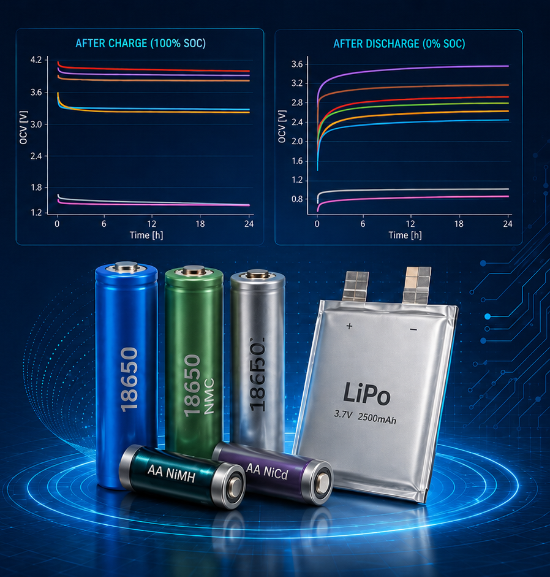

# 24-hour Raw OCV Relaxation Dataset for Rechargeable Batteries with Different Chemistries



## Overview

This dataset contains raw 24-hour open-circuit voltage (OCV) relaxation measurements for eight rechargeable batteries with different chemistries, manufacturers, nominal capacities, nominal voltages, and cell formats. The measurements were recorded after charge-based and discharge-based conditioning procedures, with the voltage monitored after the source/load was disconnected.

The tested batteries include lithium iron phosphate (LiFePO4), lithium nickel manganese cobalt oxide (LiNiMnCoO2 / NMC), lithium cobalt oxide (LiCoO2), lithium polymer (LiPo), nickel-cadmium (NiCd), and nickel-metal hydride (NiMH) cells.

The dataset is intended to support battery modeling, state-of-charge (SOC) estimation, hysteresis analysis, OCV characterization, voltage-relaxation studies, and validation of equivalent-circuit or data-driven battery models.

## Dataset Summary

| Item | Description |
|---|---|
| Dataset title | 24-hour OCV relaxation measurements after complete charge/discharge cycles for batteries with different chemistries |
| Main data format | XLSX workbook |
| Number of batteries | 8 |
| Battery chemistries | LiFePO4, LiNiMnCoO2, LiCoO2, LiPo, NiCd, NiMH |
| Measurement type | Raw OCV relaxation time series |
| Conditioning procedures | Charge-based and discharge-based SOC conditioning |
| Relaxation duration | 24 h |
| Sampling interval | 60 seconds (1 minute) |
| Rows per data sheet | 1441 rows, including 0 h and 24 h |
| Total OCV relaxation traces | 30 |
| Time unit | hours `[h]` |
| Voltage unit | volts `[V]` |
| Ambient temperature | 23 °C ± 2 °C |
| Ambient relative humidity | 65 ± 20% RH |
| OCV definition | Voltage measured after load/source disconnected |
| Instrument input impedance | 10 GOhm |
| License | Creative Commons Attribution 4.0 International (CC BY 4.0) |

## Workbook Structure

The workbook contains one metadata sheet and 16 data sheets.

### Metadata Sheet

| Sheet | Description |
|---|---|
| `Header` | Dataset description, authors, license, battery metadata, measurement equipment, test conditions, acronym definitions, and file inventory. |

### Data Sheets

Each data sheet contains one common timestamp column and one or more OCV columns. The timestamp column is always named `Timestamp [h]`. OCV columns follow the naming convention:

```text
BATT_00X_OCV_V_YY-SOC
```

where:

- `X` is the battery index.
- `YY` is the target SOC percentage.
- `OCV_V` indicates open-circuit voltage in volts.

The workbook data sheets are:

| Sheet | Description | Battery | Target SOC levels |
|---|---|---|---|
| `24h_Charge_APR` | Raw OCV relaxation after charge process | APR / `BATT_001` | 20, 40, 50, 60, 80, 100% |
| `24h_Discharge_APR` | Raw OCV relaxation after discharge process | APR / `BATT_001` | 0, 20, 40, 50, 60, 80% |
| `24h_Charge_BSE` | Raw OCV relaxation after charge process | BSE / `BATT_002` | 50, 60, 100% |
| `24h_Discharge_BSE` | Raw OCV relaxation after discharge process | BSE / `BATT_002` | 0, 50, 60% |
| `24h_Charge_SG` | Raw OCV relaxation after charge process | SG / `BATT_003` | 100% |
| `24h_Discharge_SG` | Raw OCV relaxation after discharge process | SG / `BATT_003` | 0% |
| `24h_Charge_LG` | Raw OCV relaxation after charge process | LG / `BATT_004` | 100% |
| `24h_Discharge_LG` | Raw OCV relaxation after discharge process | LG / `BATT_004` | 0% |
| `24h_Charge_OEM` | Raw OCV relaxation after charge process | OEM / `BATT_005` | 100% |
| `24h_Discharge_OEM` | Raw OCV relaxation after discharge process | OEM / `BATT_005` | 0% |
| `24h_Charge_LI` | Raw OCV relaxation after charge process | LI / `BATT_006` | 100% |
| `24h_Discharge_LI` | Raw OCV relaxation after discharge process | LI / `BATT_006` | 0% |
| `24h_Charge_AR` | Raw OCV relaxation after charge process | AR / `BATT_007` | 100% |
| `24h_Discharge_AR` | Raw OCV relaxation after discharge process | AR / `BATT_007` | 0% |
| `24h_Charge_AU` | Raw OCV relaxation after charge process | AU / `BATT_008` | 100% |
| `24h_Discharge_AU` | Raw OCV relaxation after discharge process | AU / `BATT_008` | 0% |

## Data Column Format

### Timestamp Column

| Column | Unit | Description |
|---|---|---|
| `Timestamp [h]` | hours | Time elapsed after the conditioning procedure and disconnection of the source/load. Values span 0 to 24 h at 1-minute intervals. |

### OCV Columns

| Column pattern | Unit | Description |
|---|---|---|
| `BATT_00X_OCV_V_YY-SOC` | volts | Raw measured open-circuit voltage for battery `BATT_00X` after conditioning to target SOC `YY`. |

Example columns:

| Example column | Meaning |
|---|---|
| `BATT_001_OCV_V_100-SOC` | OCV relaxation of `BATT_001` after charge conditioning to 100% SOC. |
| `BATT_001_OCV_V_20-SOC` | OCV relaxation of `BATT_001` after conditioning to 20% SOC. |
| `BATT_002_OCV_V_00-SOC` | OCV relaxation of `BATT_002` after discharge conditioning to 0% SOC. |

## Battery Metadata

| Battery index | Battery ID | Chemistry | Manufacturer | Acronym | Cell format | Nominal capacity | Nominal voltage | Internal resistance |
|---:|---|---|---|---|---|---:|---:|---:|
| 1 | `BATT_001` | LiFePO4 | Lithium Werks | APR | 18650 | 1100 mAh | 3.3 V | 12.6 mOhm |
| 2 | `BATT_002` | LiFePO4 | BSE | BSE | 18650 | 1500 mAh | 3.2 V | 35 mOhm |
| 3 | `BATT_003` | LiNiMnCoO2 | Samsung | SG | 18650 | 2500 mAh | 3.6 V | 18 mOhm |
| 4 | `BATT_004` | LiCoO2 | LG | LG | 18650 | 1500 mAh | 3.65 V | 20 mOhm |
| 5 | `BATT_005` | LiCoO2 | Shenzhen | OEM | 18650 | 1200 mAh | 3.7 V | 30 mOhm |
| 6 | `BATT_006` | LiPo | Liter Energy | LI | 10450 | 2500 mAh | 3.7 V | 47 mOhm |
| 7 | `BATT_007` | NiCd | ARTS Energy | AR | AA | 800 mAh | 1.2 V | 30 mOhm |
| 8 | `BATT_008` | NiMH | Auchan | AU | AA | 1500 mAh | 1.2 V | 35 mOhm |

## Conditioning Procedures

For the main measurements, each battery was either fully charged from 0% to 100% SOC or fully discharged from 100% to 0% SOC. After the conditioning procedure, the source or load was disconnected and the raw OCV was measured over a 24-hour relaxation period.

Additional intermediate-SOC measurements are included for two LiFePO4 batteries:

- Lithium Werks APR / `BATT_001`: charge-based target SOC levels of 20%, 40%, 50%, 60%, 80%, and 100%; discharge-based target SOC levels of 80%, 60%, 50%, 40%, 20%, and 0%.
- BSE / `BATT_002`: charge-based target SOC levels of 50%, 60%, and 100%; discharge-based target SOC levels of 60%, 50%, and 0%.

### Standard Charge and Discharge Conditions

| Battery | Standard charge | Standard discharge |
|---|---|---|
| APR / `BATT_001` | 3.6 V, 1C, termination current < 50 mA | 2.0 V, 0.2C |
| BSE / `BATT_002` | 3.65 V, 0.5C, termination current < 15 mA | 2.5 V, 0.2C |
| SG / `BATT_003` | 4.2 V, 0.5C, termination current < 125 mA | 2.5 V, 0.2C |
| LG / `BATT_004` | 4.2 V, 0.5C, termination current < 50 mA | 2.0 V, 0.2C |
| OEM / `BATT_005` | 4.2 V, 0.5C, termination current < 120 mA | 3.0 V, 0.2C |
| LI / `BATT_006` | 4.2 V, 0.5C, termination current < 150 mA | 2.75 V, 0.2C |
| AR / `BATT_007` | 0.1C for 16 h | 1.0 V, 0.2C |
| AU / `BATT_008` | 0.1C for 16 h | 1.0 V, 0.2C |

## Test Conditions

| Protocol field | Value |
|---|---|
| Sampling interval | 60 seconds (1 minute) |
| OCV definition | Voltage measured after load/source disconnected |
| Ambient temperature setpoint | 23 °C ± 2 °C |
| Ambient relative humidity | 65 ± 20% RH |
| Instrument input impedance | 10 GOhm |
| Wiring configuration | Tensility Int. Corp 26 AWG, 3.28 ft, UL1185, shielded |
| Data acquisition software | LabVIEW 2018 |

## Measurement Equipment

| Equipment ID | Type | Manufacturer | Model / Description |
|---|---|---|---|
| `EQ_001` | DC power supply | Tenma | 72-2535 |
| `EQ_002` | DC electronic load | Tenma | 72-13200 |
| `EQ_003` | Thermal chamber | Custom-built | -55 °C to 83 °C range |
| `EQ_004` | Data acquisition system | National Instruments | NI USB-6251 |
| `EQ_005` | Personal computer | HP | ProDesk 400G7 |
| `EQ_006` | State-of-charge measuring circuit | Allegro MicroSystems | ACS724 |

## Suggested Use Cases

This dataset may be used for:

- OCV relaxation analysis after charge and discharge conditioning.
- SOC estimation algorithm development and validation.
- Voltage hysteresis analysis between charge- and discharge-based OCV curves.
- Comparison of voltage relaxation behavior across battery chemistries.
- Parameter identification for equivalent-circuit battery models.
- Training or benchmarking data-driven battery models.
- Evaluation of long-duration voltage stabilization behavior.
- Educational visualization of rechargeable battery OCV dynamics.

## Basic Data-Loading Notes

When processing the workbook programmatically:

1. Read the `Header` sheet first to extract metadata.
2. Iterate through sheets beginning with `24h_Charge_` and `24h_Discharge_`.
3. Use `Timestamp [h]` as the common time axis for each sheet.
4. Treat each OCV column as one independent relaxation trace.
5. Use voltage values in volts and time values in hours.

## Data Quality Notes

- The dataset contains raw measured voltage time series.
- The data are not smoothed, filtered, or model-fitted.
- Each data sheet covers a 24-hour relaxation interval after source/load disconnection.
- The time axis is reported in hours, with 1-minute sampling intervals.
- Voltage values are reported in volts.
- The first timestamp corresponds to the start of the OCV relaxation monitoring period.
- Battery metadata, equipment details, and test conditions are stored in the `Header` sheet.

## Acronyms

| Acronym | Meaning |
|---|---|
| OCV | Open Circuit Voltage |
| SOC | State of Charge |
| V | Voltage |
| CHG | Charge |
| DCHG | Discharge |
| h | hour |
| C | C-rate |

## Authors and Contributors

- VOICILA Iulian-Teodor
- ENACHE Bogdan-Adrian
- VILCIU Irina
- SERITAN George-Calin

## Institution

National University of Science and Technology POLITEHNICA Bucharest

## Contact

For questions about the dataset, contact: `iulian.voicila@upb.ro`

## Related Publication

Voicila, T. I., Enache, B. A., Argyriou, V., Sarigiannidis, P., Pisla, M. A., Seritan, G. C. (2025). *Enhanced OCV Estimation in LiFePO4 Batteries: A Novel Statistical Approach Leveraging Real-time Knee/Elbow Detection*. MDPI Batteries, 11(5). WOS:001496608900001.

Related publication URL: https://www.mdpi.com/2313-0105/11/5/186

## License

Creative Commons Attribution 4.0 International (CC BY 4.0).

Users should cite the dataset and the related publication when using this data.

## Recommended Citation

Please cite this dataset using the DOI or citation format provided by IEEE DataPort after publication. Until the DOI is assigned, cite the dataset title, authors, institution, version, and IEEE DataPort record.

Suggested placeholder citation:

VOICILA Iulian-Teodor, ENACHE Bogdan-Adrian, VILCIU Irina, and SERITAN George-Calin, "24-hour OCV relaxation measurements after complete charge/discharge cycles for batteries with different chemistries," IEEE DataPort, Version 1, 2025. DOI: TBC.
